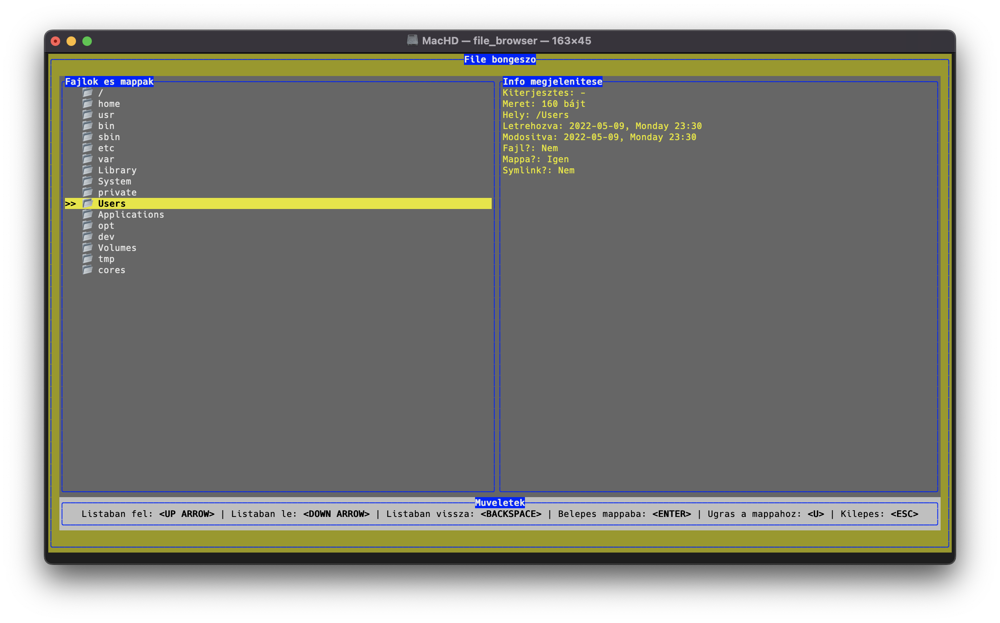
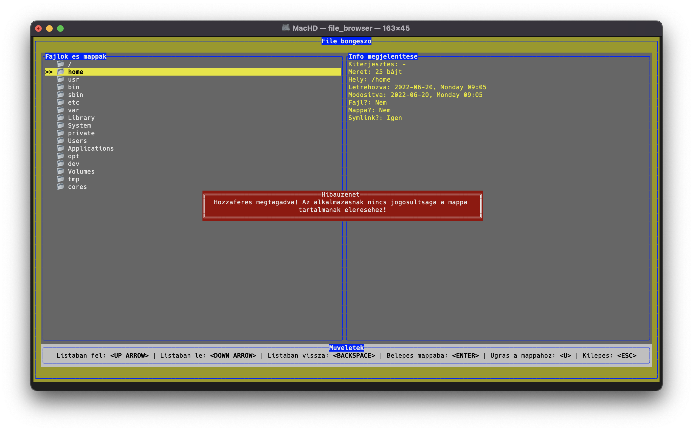
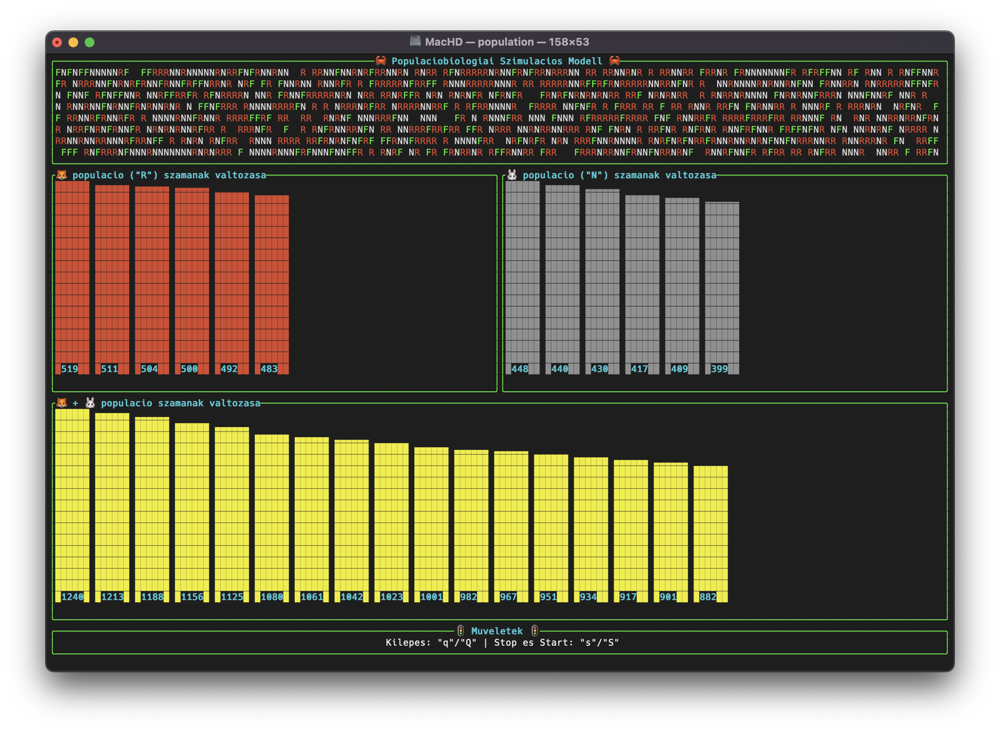
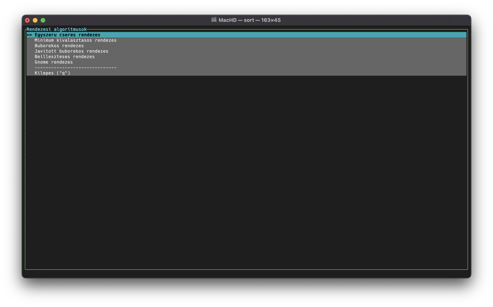
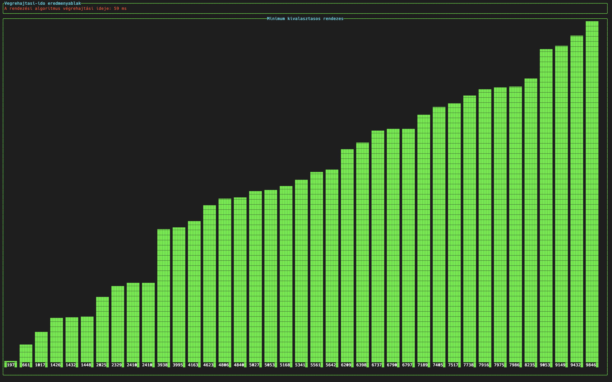

# Rust hobbi projektek 🦀

## 1. Motivacio

Az alabb felsorolt projektek celja, hogy a [Rust](https://www.rust-lang.org) programozasi nyelv elsajatitasara sarkalljanak. A tanulas es szorakozas mellett inspiral a nyelv adta "szemleletmod" megertese, elsajatitasa es magameva tetele.

> Alabb nehany forras, akik tartalmai motivaltak abban, hogy elinduljak. Halas koszonet nekik, es mindenki masnak, akik ertelmes tartalmakat gyartanak es megosztjak a tudasukat 🎉:
> - [Let's Get Rusty](https://www.youtube.com/c/LetsGetRusty)
> - [Ryan Levick](https://www.youtube.com/c/RyanLevicksVideos/featured)
> - [Jon Gjengset](https://www.youtube.com/c/JonGjengset/featured)

## 2. Hobbi projektek

### 2.1 File Browser 📂




#### 2.1.1 Altalanosan a mini projektrol

Egy olyan TUI (Terminal User Interface) alkalmazas letrehozasa volt a cel, amely kezdetben:
- kepes a konyvtarstrukuran beluli navigaciora
- az egyes fajlok es mappak alapadatainak (pl.: nev, kiterjesztes, meret stb.) megjelenitesere
- a kivalasztott file vagy mappa helyere torteno "ugrasra"
- alapveto hibalehetosegek kezelesere

A megvalositas legfelso szintjen - kodreszlet:

```rust
// ...

fn main() -> Result<(), Box<dyn Error>> {
    enable_raw_mode()?;
    let mut stdout = io::stdout(); 
    execute!(stdout, EnterAlternateScreen)?;

    let backend      = CrosstermBackend::new(stdout);
    let mut terminal = Terminal::new(backend)?;
 
    let file_browser_app_result = run_file_browser_app(&mut terminal);
    
    disable_raw_mode()?;
    execute!(terminal.backend_mut(), LeaveAlternateScreen)?;
    terminal.show_cursor()?;

    if let Err(error_message) = file_browser_app_result {
        eprintln!("Hiba tortent az alkalmazas futtatasa soran: {}", error_message)        
    }

    Ok(())
}

// ...
```

Tovabbi celkituzeseket a projekttel kapcsolatban lsd. a "Task lista" szekcioban.

#### 2.1.2 Task lista

- [x] Konyvtarstruktura navigacio:
  - [x] Konyvtarstruktura megjelenitese 
  - [x] Lepkedes az adott strukturan belul
  - [x] Belepes a mappaba
  - [x] Visszalepes a mappan belul
  - [x] Ugras az adott mappa vagy fajl helyere
- [x] Altalanos fajl infok megjelenitese:
  - [x] Kiterjesztes
  - [x] Meret
  - [x] Hely
  - [x] Letrehozva
  - [x] Modositva
  - [x] Fajl?
  - [x] Mappa?
  - [x] Symlink?
- [ ] Kereses a mappakban
- [ ] Szoveg fajlok tartalmi elonezetenek mutatasa
- [ ] OOP megvalositas es refaktoralas
- [ ] Tesztek bevezetese.

### 2.2 Populaciobiologiai Szimulacios Modell 🦊 🐰



#### 2.2.1 Altalanosan a mini projektrol

Egy olyan TUI (Terminal User Interface) alkalmazas letrehozasa volt a cel, amely kezdetben egy leegyszerusitett populaciobiologiai szimulacios modellt valosit meg:
- Egy kepzeletbeli reten (szimulacios ter) vannak rokak (R) es nyulak (N):
  - ha a roka valamely szomszedsagaban talal egy nyulat, akkor oda ugrik es megeszi
  - ha a roka elpusztul, akkor a helyere fu (F) fog noni
  - ha a nyulat nem a roka eszi meg, hanem elpusztul, akkor a helyere fu fog noni (F)
- 3 fele chart van, amin keresztul az esemenyeket vizsgaljuk:
  - az egyik a roka populacio szamanak valtozasat mutatja
  - a masik a nyul populacio szamanak valtozasat mutatja
  - a harmadik pedig a populacio teljes szamanak valtozasat mutatja
  
A megvalositas legfelso szintjen - kodreszlet:
```rust
// ...

fn main() -> Result<(), Box<dyn Error>> {
    let fox_birth_probability: f64        = read_data("🦊 szuletesenek valoszinusege (0.0..1.0):", "Hiba tortent a beolvasas soran!");
    let fox_mortality_probability: f64    = read_data("🦊 halalozasanak valoszinusege (0.0..1.0):", "Hiba tortent a beolvasas soran!");
    let rabbit_mortality_probability: f64 = read_data("🐰 halalozasanak valoszinusege (0.0..1.0):", "Hiba tortent a beolvasas soran!");

    enable_raw_mode()?;
    let mut stdout = io::stdout();
    execute!(stdout, EnterAlternateScreen)?;

    let backend      = CrosstermBackend::new(stdout);
    let mut terminal = Terminal::new(backend)?;
    
    let run_app_result = run_app(&mut terminal, fox_birth_probability, fox_mortality_probability, rabbit_mortality_probability);

    disable_raw_mode()?;
    execute!(terminal.backend_mut(), LeaveAlternateScreen)?;
    terminal.show_cursor()?;

    if let Err(error_message) = run_app_result {
        println!("Hiba: {:?}", error_message)
    } else {
        println!("\nSzimulacio vege...");
    }

    Ok(())
}

// ...
```

Tovabbi celkituzeseket a projekttel kapcsolatban lsd. a "Task lista" szekcioban!

#### 2.2.2 Task lista

- [x] Szuletes es halalozas bevezetese
- [x] Rokak es nyulak elhelyezese a szimulacios terben
- [x] Zsakmanyszerzes kezelese
- [x] Chartok hozzaadasa
- [ ] Szimulacio "vegenek" kezelese
- [ ] A nyul (N) megeszi a fuvet (F)
- [ ] Jarvany megjelenesenek bevezetese
- [ ] OOP megvalositas es refaktoralas
- [ ] Tesztek bevezetese.

### 2.3 Rendezesi algoritmusok 📊




#### 2.3.1 Altalanosan a mini projektrol

Egy olyan TUI (Terminal User Interface) alkalmazas megvalositasa volt a cel, amely kezdetben nehany alapveto rendezesi algoritmus mukodeset mutatna be. Ezek a kovetkezok:
- Egyszeru cseres rendezes
- Minimumkivalasztasos rendezes
- Buborekos rendezes
- Javitott buborekos rendezes
- Beilleszteses rendezes
- Gnome rendezes

A megvalositas legfelso szintjen - kodreszlet:

```rust
// ...

fn main() -> Result<(), Box<dyn Error>> {
    enable_raw_mode()?;
    let mut stdout = io::stdout();
    execute!(stdout, EnterAlternateScreen)?;

    let backend      = CrosstermBackend::new(stdout);
    let mut terminal = Terminal::new(backend)?;

    let mut numbers: Vec<u64> = Vec::new();
    let run_app_result = run_app(&mut terminal, &mut numbers);

    disable_raw_mode()?;
    execute!(terminal.backend_mut(), LeaveAlternateScreen)?;
    terminal.show_cursor()?;

    if let Err(error_message) = run_app_result {
        println!("Hiba: {}", error_message)
    }

    Ok(())
}

// ...
```

Tovabbi celkituzeseket a projekttel kapcsolatban lsd. a "Task lista" szekcioban!

#### 2.3.2 Task lista

- [x] Rendezesi lista megvalositasa
- [x] Rendezesi algoritmusok bevezetese
- [x] Vizualis megjelenites.
- [ ] OOP megvalositas es refaktoralas
- [ ] Tesztek bevezetese


> Felhasznalt irodalom:
> - Szlávi Péter - Zsakó László: Módszeres programozás: Programozási tételek, ELTE Informatikai Kar.
